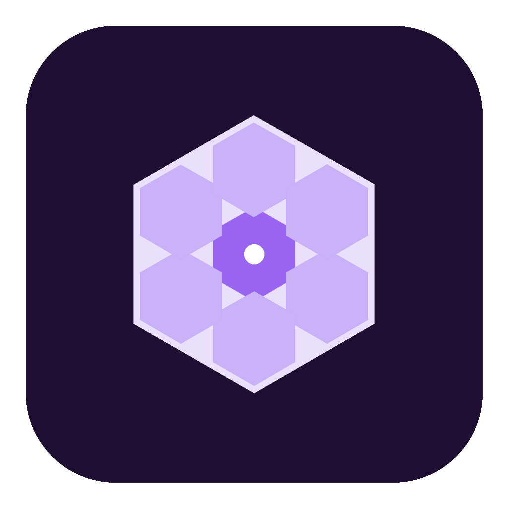
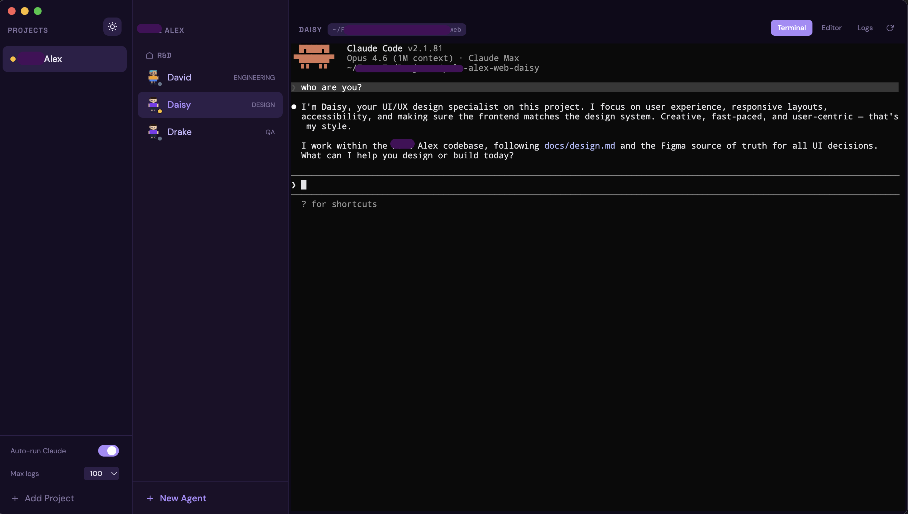
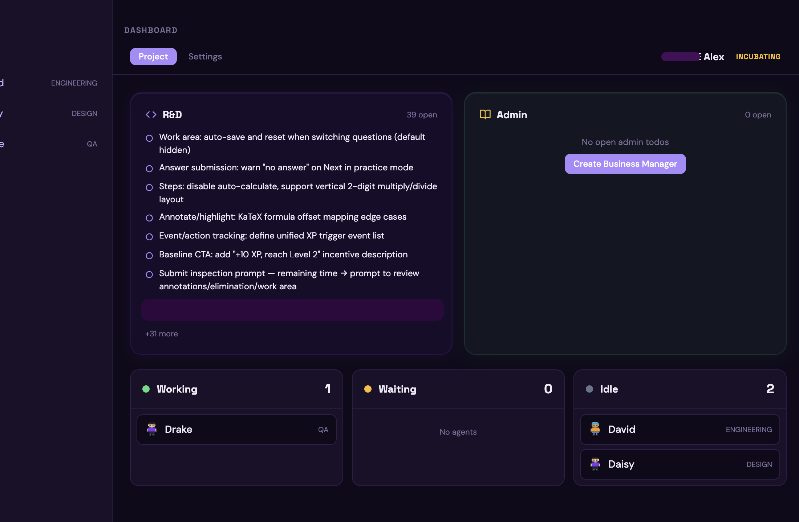
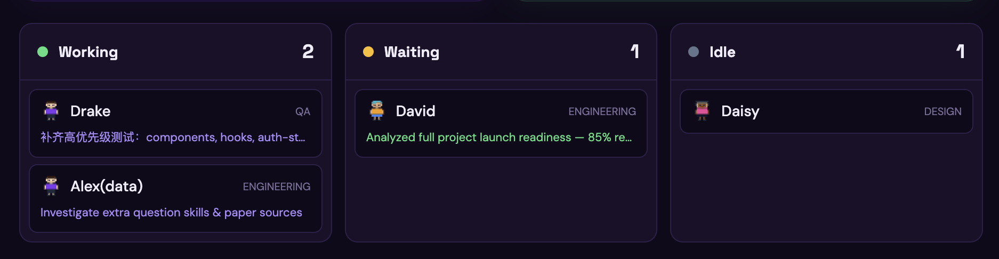
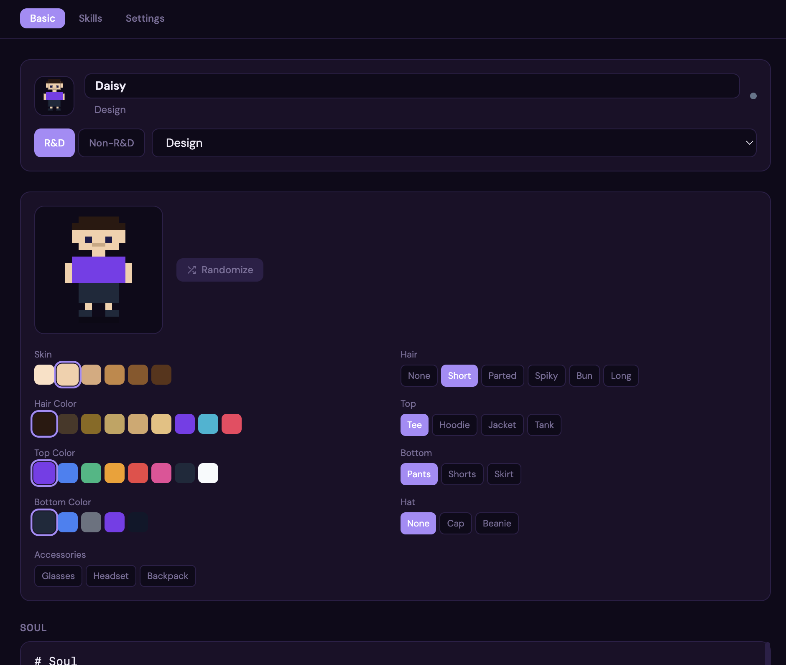
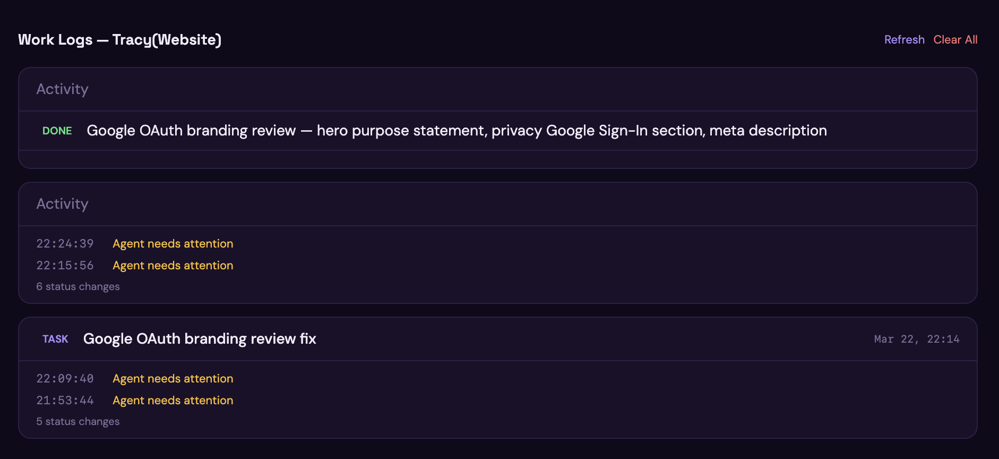

<div align="center">



# Hive

**Your AI agents deserve an office.**

A macOS desktop app to manage multiple [Claude Code](https://claude.ai/claude-code) agents — each with its own soul, skills, and workspace.

[](https://github.com/nocodevit/hive/stargazers)
[](LICENSE)
[]()
[]()


*Three-column layout: Projects, Agents by department, and Terminal with soul-injected Claude Code session*

[Download](#getting-started) · [Features](#features) · [Roadmap](#roadmap) · [Contributing](#contributing)

</div>

---

## Why Hive?

Running multiple Claude Code instances means juggling terminal tabs, losing context, and zero visibility into what each agent is doing. Hive fixes that.

| Without Hive | With Hive |
|---|---|
| 5 terminal tabs, which one is which? | Named agents organized by department |
| Every agent is the same generic assistant | Each agent has a soul — personality, role, boundaries |
| No idea what each agent is working on | Real-time status via hooks, work logs, dashboard |
| Skills scattered everywhere | Visual skill browser, toggle per agent |
| Restart = context lost | Persistent memory per agent |

## Screenshots

### Project Dashboard

*Glassmorphism R&D and Admin cards scan your project's markdown files for todos. Agent kanban shows real-time status with pixel avatars. Project stage (Active/Incubating/Early Stage) auto-detected from git activity.*

### Agent Board

*Agents grouped by status. Each card shows avatar, role, department, and current task title. Task summaries auto-reported by Claude via hooks.*

### Agent Editor

*Configure identity (name, department, role), customize pixel avatar (skin, hair, clothes, accessories), and write soul.md to define personality and boundaries. Tabbed interface: Basic, Skills, Settings.*

### Work Logs

*Activity grouped by task blocks. Each task shows title (START badge), summary (DONE badge), and status timeline. Persistent across sessions.*

### Soul in Action

*Native `--agent` integration. Claude responds in character — "I'm Daisy, your UI/UX specialist" — with role-specific knowledge, skills, and personality.*

## Features

### Native Claude Code Agent Integration
Each agent is a native Claude Code `--agent` definition (`.claude/agents/hive-{id}.md`). Includes personality, tools, model, effort level, skills, and status hooks — all in one file. Session resume via `claude -c`. No custom workarounds.

### Agent Template System
8 built-in role templates (Full-Stack Engineer, Product, QA, Design, Admin, Marketing, BA, Operations) with structured sections: Role, Workflow, Boundaries, Custom. Create from template, customize, or import .md files. Save custom templates for reuse. Project CLAUDE.md auto-loads into Custom section.

### Split Soul Editor
Left-right split: write markdown on the left, see rendered preview on the right. Real-time updates as you type.

### Default Skills per Department
Configure global default skills for R&D and Non-R&D agents in Project Settings. New agents auto-inherit defaults. Override per agent during creation.

### Multiple Agent Terminals
Run N Claude Code sessions side by side. Click to switch. Each terminal persists — switch between agents without losing state. Auto-run Claude on terminal open.

### Agent Roles & Departments
- **R&D**: Engineering, Product, QA, Design
- **Non-R&D**: Admin, HR, Marketing, BA, Operations, GM
- 12 personality traits: Detail-oriented, Creative, Analytical, Security-first, etc.

### Pixel Avatar Editor
Customize each agent's appearance: skin tone, hair style/color, top/bottom style/color, hat, and accessories (glasses, headset, backpack). Randomize button for quick setup.

### GStack Skills Integration
Browse and toggle [GStack](https://github.com/garrytan/gstack) skills per agent. Expand any skill to read the full SKILL.md content. Skills auto-linked to agent's working directory.

### Project Dashboard
- **Glassmorphism todo cards** — R&D and Admin todos scanned from project markdown files
- **Agent kanban** — Working / Waiting / Idle columns with avatars and task titles
- **Project status** — Auto-detected: Active Online, Active, Incubating, Early Stage
- **Project Settings** — Add/remove R&D and Non-R&D folders inline

### Task Reporting
Claude auto-reports task start (title) and completion (summary) via `.claude/hive-report.sh`. Displayed in agent title bar, kanban cards, and grouped work logs.

### Status Hooks
Claude Code hooks report agent status to Hive via localhost webhook (port 17710). `PreToolUse` → working, `Stop` → idle. Deduped — only status changes are logged.

### Git Worktree Isolation
Each coding agent automatically gets its own git worktree and branch. Agents work in parallel without conflicts. Worktree auto-removed when agent is deleted.

### Agent Memory
Each agent has isolated persistent memory at `~/.hive/memory/{agentId}/`. Symlinked to working directory. Keyed by ID, survives renames.

### Work Logs
Permanent activity log per agent. Tasks grouped with START/DONE badges. Status timeline. Refresh and Clear All controls.

## Architecture

```
┌────────────────────────────────────────────────────────────────┐
│                          Hive App                              │
│                                                                │
│  ┌──────────┬─────────────┬────────────────────┬─────────────┐ │
│  │ Projects │   Agents    │  Terminal / Editor  │   Files     │ │
│  │          │             │                    │             │ │
│  │ Alex  ●  │ R&D         │  $ claude          │  app.tsx    │ │
│  │          │  David  ENG │    --agent hive-xxx │  style.css  │ │
│  │          │  Daisy  DES │    -c -n "david"   │  .env.local │ │
│  │          │  Drake  QA  │                    │             │ │
│  │  [+ Add] │    [+ New]  │  [native agent]    │  [search]   │ │
│  └──────────┴─────────────┴────────────────────┴─────────────┘ │
│                                                                │
│  Electron · React · xterm.js · node-pty                        │
└────────────────────────────────────────────────────────────────┘
        │                              │
        ▼                              ▼
  ~/.hive/                    .claude/agents/hive-{id}.md
  ├── data.json               (native agent definition with
  ├── memory/{agentId}/        hooks, skills, model, effort)
  └── logs/{agentId}.json            │
                              localhost:17710 (webhook)
```

## Tech Stack

| Layer | Technology |
|-------|-----------|
| Desktop | Electron 35 |
| Frontend | React 18 + TypeScript + Tailwind CSS |
| Terminal | xterm.js + node-pty *(same as VS Code & Cursor)* |
| Build | Vite + electron-vite |
| Theme | Purple primary, light/dark, CSS custom properties |
| Fonts | Space Grotesk + DM Sans |

## Getting Started

### Prerequisites

- macOS (Apple Silicon or Intel)
- Node.js 20+
- [Claude Code](https://claude.ai/claude-code) CLI installed

### Download (macOS)

| Version | Description | Download |
|---------|-------------|----------|
| v0.4.0-beta | Native --agent, templates, split editor, session resume | [DMG (Apple Silicon)](https://github.com/nocodevit/hive/releases/tag/v0.4.0-beta) |
| v0.3.0-beta | Office viz, files panel, resizable, job pickup | [Release](https://github.com/nocodevit/hive/releases/tag/v0.3.0-beta) |
| v0.2.0-beta | Soul injection, task reporting, avatar editor, worktree | [Release](https://github.com/nocodevit/hive/releases/tag/v0.2.0-beta) |

Or via Homebrew:
```bash
brew install --cask nocodevit/tap/hive
```

> First launch: Right-click → Open, or run `xattr -cr /Applications/Hive.app`

### Build from Source

```bash
git clone https://github.com/nocodevit/hive.git
cd hive
npm install
npm run dev
```

### Install GStack Skills (Optional)

```bash
brew install oven-sh/bun/bun
git clone https://github.com/garrytan/gstack.git ~/.claude/skills/gstack
cd ~/.claude/skills/gstack && ./setup
```

Restart Hive — skills appear in Agent Editor under the Skills tab.

## How It Works

1. **Create a Project** — Point to your R&D and Non-R&D folders
2. **Add Agents** — Pick a department, role, personality traits
3. **Soul auto-generates** — Based on name + role + traits
4. **Start working** — Click an agent, Claude launches with native `--agent` flag
5. **Resume anytime** — `claude -c` restores full conversation context
6. **Monitor** — Dashboard shows status, kanban, todos. Logs track everything.

## Data Storage

| Data | Location |
|------|----------|
| Projects & Agents | `~/.hive/data.json` |
| Agent Definitions | `{project}/.claude/agents/hive-{agentId}.md` |
| Agent Memory | `~/.hive/memory/{agentId}/` |
| Work Logs | `~/.hive/logs/{agentId}.json` |
| Skills | `~/.claude/skills/` |
| Status Hooks | Embedded in agent definition file |

## Roadmap

- [x] Multi-agent terminal management
- [x] Soul auto-generation from role + personality traits
- [x] Native Claude Code `--agent` integration (replaces soul injection)
- [x] Session resume via `claude -c` (replaces job pickup)
- [x] Agent template system (8 built-in + custom + import .md)
- [x] Split soul editor (markdown + live preview)
- [x] Default skills per department (global config)
- [x] GStack skills integration with detail view
- [x] Status hooks (working/waiting/idle via PreToolUse/Stop)
- [x] Task reporting (title/summary via hive-report.sh)
- [x] Work logs grouped by task with START/DONE badges
- [x] Agent memory isolation per agentId
- [x] Project dashboard with glassmorphism todo cards
- [x] Agent kanban with pixel avatars
- [x] Pixel avatar editor (skin, hair, clothes, accessories)
- [x] Git worktree auto-management
- [x] Project status auto-detection (Active/Incubating/Early Stage)
- [x] Agent roles: R&D (Engineering/Product/QA/Design) + Non-R&D (Admin/HR/Marketing/BA/Operations/GM)
- [x] Light/dark theme
- [x] Office visualization (Canvas 2D animated pixel office)
- [x] Files panel (right sidebar, search, drag-to-terminal)
- [x] Resizable sidebar panels
- [x] Job pickup (auto-resume from work logs)
- [x] Agent groups within departments (drag-to-reorder)
- [x] Terminal scroll-to-bottom button (follows system)
- [x] Project Settings tab (add/remove folders inline)
- [ ] **Multi-agent communication** — Message relay via webhook, then MCP Server ([plan](docs/multi-agent-comms-plan.md))
- [ ] **MCP Server** — Auto-reporting without soul instructions
- [ ] **Agent drag-to-reorder across groups**
- [ ] **GNU Screen session persistence** — Terminal sessions survive app restart
- [ ] **Notification integrations** — Slack, Telegram, WhatsApp, macOS
- [ ] **Office visualization upgrade** — Phaser 3 + real sprite assets (currently Canvas 2D)
- [ ] **Offline log buffer** — hive-report.sh saves to local file when Hive is offline, syncs on reconnect
- [ ] Agency-Agents role templates
- [ ] claude-mem / memsearch for enhanced memory

## Contributing

Contributions welcome! Please read the [license](LICENSE) — AGPL-3.0 means your changes must also be open source.

```bash
# Development
npm run dev

# Build
npm run build

# Test
npm test
```

## License

[AGPL-3.0](LICENSE) — Open source. Fork freely. Commercial use requires authorization.

---

<div align="center">

**If Hive helps you manage your AI agents, give it a star!**

[](https://github.com/nocodevit/hive)

</div>
